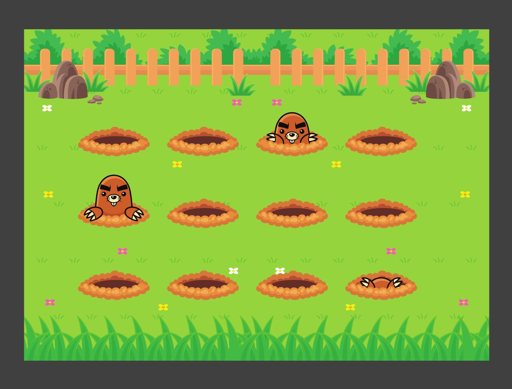

<h1 align=center>Wack a Mole</h1>

Projeto para praticar animações com <code>@keyframes</code>

 

 

 

## <strong>Tecnologias</strong>

- HTML
- CSS
- Figma
- Piskel

 

### CSS

As toupeiras se movem para cima e para baixo, foi usado somente <code>@frameworks</code> do CSS, com a utilização de JavaScript posso tornar isto aleatório e jogável.

 

### Piskel

Com o Piskel eu fiz a string sheet da animação, para a animação ficar mais fluida. Até tentei fazer utilizando a troca de imagem para cada etapa da animação, mas dessa maneira não ficava legal e nem parecido com o original.

 

## <strong>Projeto</strong>

Este projeto foi desenvolvido e proposto pela Rocketseat para que seus alunos possam praticar e revisar o que foi aprendido em aula.
